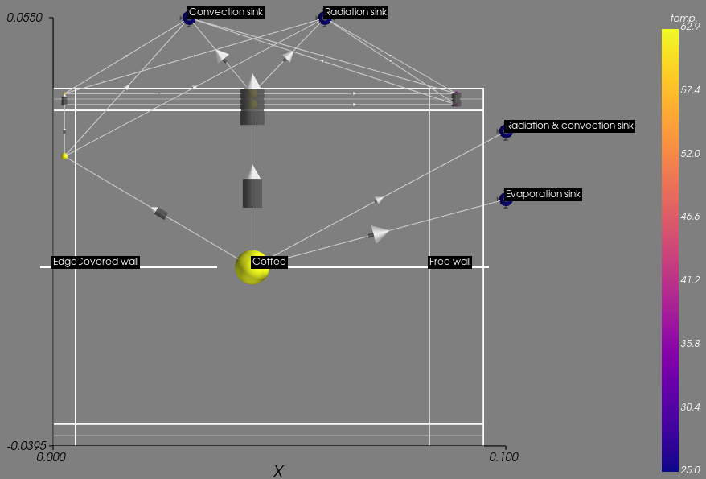

.. Thermca documentation master file, created by
   sphinx-quickstart on Mon Aug 29 15:51:31 2016.
   You can adapt this file completely to your liking, but it should at least
   contain the root `toctree` directive.

*******
Thermca
*******

Thermca is a pure python program for thermal behavior
analysis. With Thermca you can simulate real world problems with
`a few lines of code`_.

.. _a few lines of code: examples/basic_butter.html

The application focuses on the analysis of solid bodies that thermally
interact over solid state conductivity, convection and heat radiation.
The geometry of solid state bodies can be created by assembling basic
geometries or using complex CAD geometries.
The non linear effects of convection, heat radiation as well as
the non linear behaviour of solid and fluid materials can be taken into
account.
The variety of real world convection and radiation effects are modeled
by empirical equations that can be found in a extensible library.
The material properties of solids and fluids can be taken from a
material database.
Powerful visualisation features are available to show model
properties and simulation results. With this you can quickly achieve a
comprehensive understanding of the
`thermal behaviour and it causes`_.

.. _thermal behaviour and it causes: examples/coffeecup.html

.. toctree::
    :maxdepth: 2

    quickstart
    thermca_api
    libraries
    create_part_meshes

Indices and tables
==================

* :ref:`genindex`
* :ref:`modindex`
* :ref:`search`

